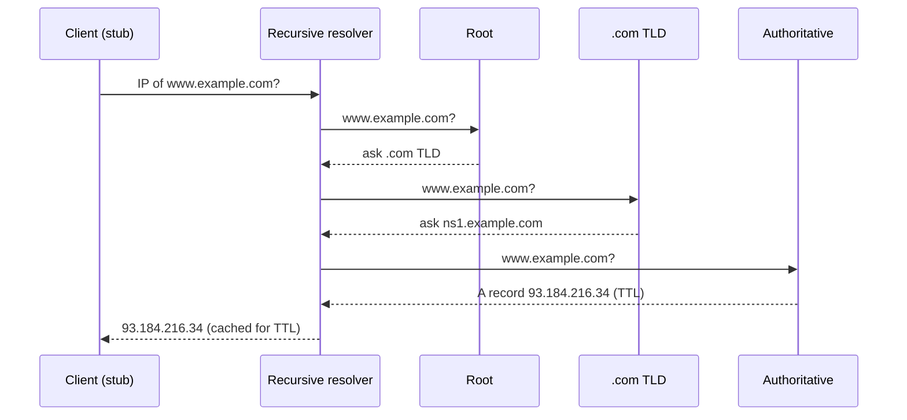
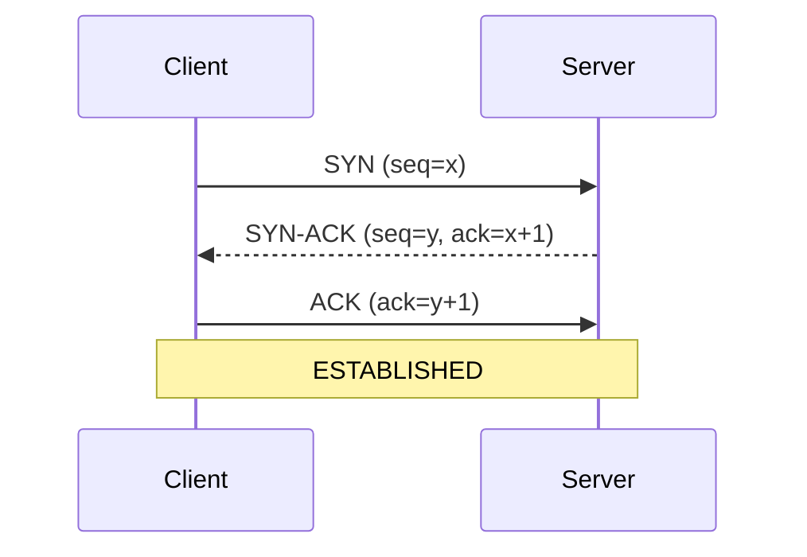
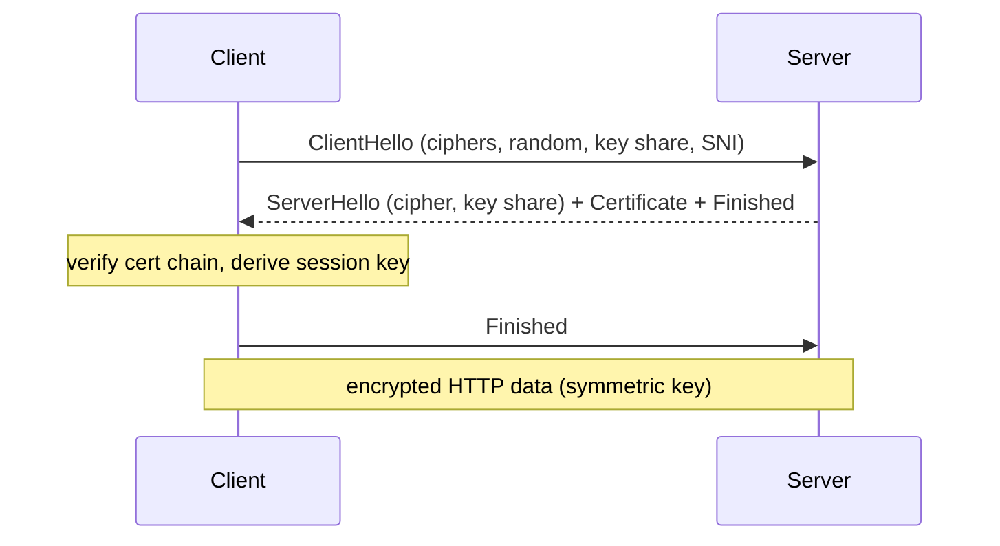
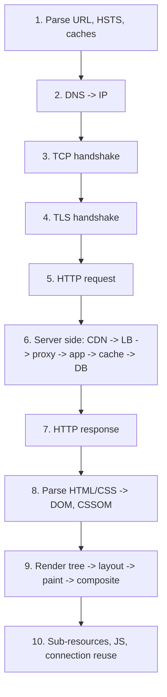
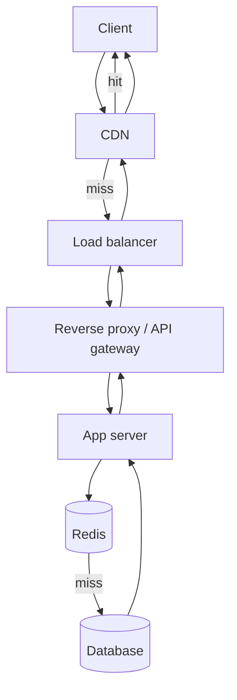
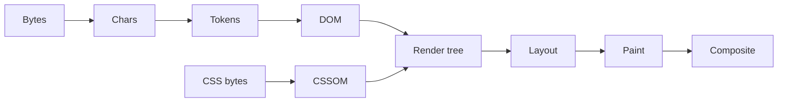

# 1.1 Networking & Request Lifecycle — Day 1: IP, DNS, TCP vs UDP

## One-page summary
- IP address finds the machine. Port finds the program. Connection = (protocol, src IP, src port, dst IP, dst port).
- DNS turns a domain into an IP. Hierarchy: root → TLD → authoritative. A recursive resolver does the walking and caches by TTL.
- TCP = reliable, ordered, connection-based (3-way handshake, ACKs, retransmit, flow + congestion control). UDP = fast, no guarantees.
- New TCP connection costs 1 RTT and starts slow, so reuse connections (keep-alive, pooling).
- Flow control protects the receiver. Congestion control protects the network.

---

## Layers
| Layer | Example | Job |
|---|---|---|
| Application | HTTP, DNS | What the data means |
| Transport | TCP, UDP | Process to process (ports) |
| Network | IP | Host to host routing |
| Link | Ethernet, Wi-Fi | Hop to hop |

IP is best-effort and unreliable. TCP adds reliability on top.

## Ports
HTTP 80 · HTTPS 443 · DNS 53 · SSH 22 · Postgres 5432 · MySQL 3306 · Redis 6379 · MongoDB 27017

---

## DNS

**Purpose:** domain name → IP (plus other records).

### Hierarchy
`www.example.com.` reads right to left: root (.) → TLD (.com) → authoritative (example.com) → host (www)

- **Root:** knows only who runs each TLD. 13 logical addresses, hundreds of physical servers (anycast).
- **TLD:** knows the authoritative servers for each domain.
- **Authoritative:** holds the real records (Route 53, Cloudflare).
- **Recursive resolver:** ISP, 8.8.8.8, 1.1.1.1. Does the work, caches results.
- **Stub resolver:** the OS/browser client that asks the recursive resolver.

### Resolution (cold cache)

Before this: browser cache → OS cache → /etc/hosts.

- **Recursive query:** client → resolver, "get me the final answer."
- **Iterative query:** resolver → root/TLD/auth, follows referrals itself.

### Record types
| Type | Meaning |
|---|---|
| A / AAAA | name → IPv4 / IPv6 |
| CNAME | alias → another name (not allowed at zone apex with other records) |
| NS | authoritative nameservers |
| MX | mail servers |
| TXT | free text (SPF, verification) |
| SOA | zone metadata |
| PTR | reverse lookup (IP → name) |

### TTL and caching
- Cached at browser, OS, resolver, sometimes app (JVM caches by default, Node doesn't).
- Low TTL: fast changes, more lookups. High TTL: fewer lookups, slow propagation.
- Before a migration, lower TTL at least one old-TTL period earlier.
- Negative caching: NXDOMAIN is cached too.

### Transport
UDP/53 normally. TCP/53 for large responses, zone transfers, DNSSEC. DoH/DoT encrypt DNS.

### System design relevance
- **Round robin:** multiple A records, crude load balancing.
- **GeoDNS / latency routing:** different IP per region.
- **Anycast:** same IP announced from many places, BGP routes to nearest. CDNs, root servers.
- **Failover:** health checks + low TTL. Only as fast as TTL; some clients ignore it.
- **Weakness:** clients cache, one resolver fronts many users, so it's a poor precise load balancer.

---

## TCP vs UDP
| | TCP | UDP |
|---|---|---|
| Connection | Yes | No |
| Reliable | Yes (ACK + retransmit) | No |
| Ordered | Yes | No |
| Flow/congestion control | Yes | No |
| Header | 20B+ | 8B |
| Unit | Byte stream | Datagram |
| Use | HTTP, DBs, SSH, email | DNS, voice/video, gaming, QUIC |

**UDP wins when:** latency matters more than completeness (late video packet is useless), the app does its own reliability (QUIC), or tiny one-shot request/response (DNS).

### 3-way handshake

- Syncs initial sequence numbers, confirms both directions work. Cost: 1 RTT.
- Why 3, not 2: server needs proof the client got its SYN-ACK; also blocks stale/duplicate SYNs.
- **SYN flood:** attacker never sends final ACK, fills half-open queue. Defense: SYN cookies, rate limiting.

### Teardown
FIN → ACK → FIN → ACK. Side that closes first enters **TIME_WAIT** (~60s). Many short connections can exhaust ports. Fix: reuse/pool connections.

### How TCP is reliable
- **Sequence numbers + ACKs:** detect loss, restore order.
- **Retransmission:** on timeout or 3 duplicate ACKs (fast retransmit).
- **Flow control:** receiver advertises window size. Protects the **receiver**.
- **Congestion control:** slow start → congestion avoidance → fast recovery (Reno, CUBIC, BBR). Protects the **network**.
- New connections start slow (initial cwnd ~10 segments), so reuse matters.
- **Nagle / TCP_NODELAY:** Nagle batches small writes; latency-sensitive apps disable it.

### Head-of-line blocking
TCP delivers in order, so one lost packet stalls everything behind it. Motivates QUIC/HTTP3 (Day 2).

---

## Common traps
- "DNS is just a lookup" → say hierarchical, cached, TTL-driven, anycast.
- "TCP is reliable" without saying how (seq, ACK, retransmit, windows).
- Mixing flow control (receiver) with congestion control (network).
- Forgetting DNS falls back to TCP.

## Self-test
1. Why does DNS use UDP, and when does it switch to TCP?
2. Recursive vs iterative query?
3. Authoritative TTL is 24h and you change the IP now. What happens?
4. Why 3-way handshake, not 2-way?
5. What is TIME_WAIT and what problem can it cause?
6. Flow control vs congestion control?
7. When pick UDP over TCP? Two examples.
8. What is anycast and who uses it?
9. Cost of a new TCP connection, and how to avoid paying it repeatedly?

## Things I got wrong
- (fill in after your recall drill)


---

# Day 2: HTTP and HTTPS/TLS

## One-page summary
- HTTP = stateless request/response over TCP. Client always starts.
- Idempotent methods (GET, PUT, DELETE) are safe to retry. POST is not (use idempotency keys).
- 401 = not authenticated, 403 = not allowed, 502 = bad upstream reply, 504 = upstream timeout.
- 1.1: keep-alive. 2: multiplexing, still TCP HOL blocking. 3: QUIC over UDP, independent streams.
- HTTPS = HTTP + TLS: confidentiality, integrity, authentication.
- TLS: asymmetric/ECDHE to agree on a key, symmetric (AES-GCM) to encrypt data.
- Certificate signed by a trusted CA proves server identity.
- Cold HTTPS request is about 4 RTTs before first byte (DNS + TCP + TLS 1.3 + HTTP).

---

## HTTP

### Request
```
GET /api/users?id=5 HTTP/1.1      <- method, path+query, version
Host: example.com                 <- headers
Authorization: Bearer <token>
Cookie: sid=abc

<optional body>
```

### Response
```
HTTP/1.1 200 OK                   <- status line
Content-Type: application/json
Cache-Control: max-age=60
Set-Cookie: sid=abc; HttpOnly

{...}
```

### Methods
| Method | Safe | Idempotent | Notes |
|---|---|---|---|
| GET | yes | yes | read |
| HEAD | yes | yes | headers only |
| POST | no | no | create / action |
| PUT | no | yes | full replace |
| PATCH | no | usually no | partial update |
| DELETE | no | yes | |
| OPTIONS | yes | yes | CORS preflight |

Idempotent = repeating gives same result as doing it once. Matters for retries. PUT `/users/5` ten times = same state. POST `/orders` ten times = ten orders.

### Status codes
| Range | Meaning | Remember |
|---|---|---|
| 1xx | info | 101 Switching Protocols (WebSocket) |
| 2xx | success | 200, 201 Created, 204 No Content |
| 3xx | redirect | 301 permanent, 302/307 temporary, 304 Not Modified |
| 4xx | client error | 400, 401, 403, 404, 409 conflict, 429 rate limited |
| 5xx | server error | 500, 502, 503, 504 |

- 401 = "who are you?", 403 = "I know you, no."
- 502 = proxy got bad/refused reply from upstream. 504 = upstream timed out.

### Headers
- **Caching:** `Cache-Control` (max-age, no-store, no-cache, public/private), `ETag` + `If-None-Match`, `Last-Modified` + `If-Modified-Since`. Unchanged -> 304, no body.
- **Content:** `Content-Type`, `Content-Length`, `Content-Encoding` (gzip, br), `Accept`.
- **Connection:** `Host` (required in 1.1, enables virtual hosting), `Connection: keep-alive`.
- **Auth/state:** `Authorization`, `Cookie`, `Set-Cookie` flags: HttpOnly (blocks JS read, stops XSS theft), Secure (HTTPS only), SameSite (limits CSRF).
- **Proxy:** `X-Forwarded-For` (real client IP), `X-Forwarded-Proto`.
- **CORS:** `Origin`, `Access-Control-Allow-*`. Browser blocks cross-origin reads unless the server allows.
- **Security:** `Strict-Transport-Security` (HSTS), `Content-Security-Policy`.

### Stateless
Server remembers nothing between requests. State travels in cookies/tokens or lives in a shared store (Redis). Any server can handle any request, so horizontal scaling works.

### Versions
| Version | Transport | Key points |
|---|---|---|
| 1.0 | TCP | new connection per request |
| 1.1 | TCP | keep-alive, Host header. One request at a time per connection (HTTP-level HOL blocking). Browsers open ~6 parallel connections per host |
| 2 | TCP | multiplexing many streams on one connection, binary framing, HPACK header compression. Still TCP-level HOL blocking |
| 3 | QUIC (UDP) | independent streams, built-in TLS 1.3, faster setup, connection migration (Wi-Fi to cellular) |

---

## HTTPS / TLS

### Why
Plain HTTP can be read, modified, or impersonated by anyone on the path.

| Goal | How |
|---|---|
| Confidentiality | encryption |
| Integrity | tamper detection (MAC/AEAD) |
| Authentication | certificates |

TLS sits between TCP and HTTP. Port 443.

### Symmetric vs asymmetric
- **Symmetric:** same key locks/unlocks. Fast. Used for data (AES-GCM, ChaCha20). Problem: how to share the key.
- **Asymmetric:** public/private key pair. Slow. Used to authenticate and agree on a key (ECDHE, RSA signatures).
- **TLS uses both:** asymmetric briefly to agree on a secret, symmetric for all data.
- ECDHE: both sides build the same secret over a public channel without sending it.

### Certificates
Certificate = "this public key belongs to example.com", signed by a CA.

Chain: leaf (server) -> intermediate CA -> root CA (pre-installed in browser/OS trust store).

Client checks:
1. Chains to a trusted root
2. Domain matches (CN/SAN)
3. Not expired or revoked (CRL/OCSP)
4. Signature valid

Any failure -> "connection not private" warning.

### TLS 1.3 handshake


- TLS 1.2: 2 RTT. TLS 1.3: 1 RTT, weak ciphers removed, forward secrecy mandatory.
- **0-RTT resumption:** replay risk, use only for idempotent requests.
- **Session resumption (tickets):** skip full handshake on reconnect.

### Terms
- **SNI:** client sends domain in ClientHello so one IP can host many HTTPS sites and server picks the right cert.
- **Forward secrecy:** ephemeral keys, so a leaked server key can't decrypt past traffic.
- **HSTS:** browser always uses HTTPS for that domain (prevents downgrade).
- **TLS termination:** LB/reverse proxy decrypts, forwards plain or re-encrypted traffic to backends.
- **mTLS:** client also presents a certificate. Common between microservices.

### What HTTPS does not hide
- Destination IP, and domain (via SNI and DNS, unless ECH/DoH).
- Does not protect against malicious servers, SQL injection, XSS.

---

## Cold HTTPS request cost
| Step | RTT |
|---|---|
| DNS | 1+ |
| TCP handshake | 1 |
| TLS 1.3 | 1 |
| HTTP request/response | 1 |
| **Total** | **~4** (5 with TLS 1.2) |

Why these exist: keep-alive / pooling (skip TCP+TLS), CDN (shorter distance), TLS 1.3 + HTTP/3 (fewer RTTs), DNS caching/prefetch.

---

## Common traps
- Claiming HTTP/2 fully fixes HOL blocking (only HTTP-level; TCP-level remains, HTTP/3 fixes it).
- Saying HTTPS "encrypts data with the public key" (asymmetric is only for key agreement).
- Mixing 401/403 or 502/504.
- Not knowing why POST isn't safe to retry.
- Forgetting the domain still leaks via SNI/DNS.

## Self-test
1. Four parts of an HTTP request?
2. Why is PUT idempotent and POST not? Why does it matter?
3. 401 vs 403? 502 vs 504?
4. What does 304 mean, and which headers enable it?
5. What does HttpOnly do?
6. What does HTTP/2 solve over 1.1? What remains? How does HTTP/3 fix it?
7. Why does TLS use both asymmetric and symmetric?
8. What does a certificate prove, and who vouches for it?
9. What does SNI solve?
10. What is forward secrecy?
11. RTTs for a cold HTTPS request?
12. What is TLS termination?

## Things I got wrong
- (fill in after your recall drill)


---

# Day 3: URL to Render + System Design Hooks (detailed)

## One-page summary
- Flow: URL parse -> cache checks -> DNS -> TCP -> TLS -> HTTP request -> CDN -> LB -> reverse proxy -> app -> cache -> DB -> response -> DOM/CSSOM -> render tree -> layout -> paint -> composite -> sub-resources.
- Cold HTTPS request is ~4 RTTs before first byte. Every optimization removes an RTT, shortens distance, or avoids work.
- A request can be answered without reaching origin: browser cache, service worker, CDN.
- CSS blocks rendering. Sync JS blocks HTML parsing. `async`/`defer` fix the second.
- Servers stay stateless so any instance can serve any request.
- Retry only idempotent requests, with timeouts, exponential backoff and jitter.

---

## 1. The flow



### Step 1: URL parsing and local checks
`https://shop.example.com:443/products?id=5#reviews`

| Part | Value |
|---|---|
| Scheme | https |
| Host | shop.example.com |
| Port | 443 (default for https, 80 for http) |
| Path | /products |
| Query | id=5 |
| Fragment | #reviews (never sent to server, handled by browser) |

Then the browser checks, in order:
1. **Is it a URL or a search?** If not valid URL, send to search engine.
2. **HSTS list** (preloaded + learned): if the domain is on it, `http://` is upgraded to `https://` locally. No insecure request is ever sent.
3. **Service worker** (if registered): may answer from its own cache or intercept the request.
4. **HTTP cache:**
   - Fresh (`Cache-Control: max-age` not expired): served from disk/memory, **zero network**.
   - Stale with validator (`ETag`/`Last-Modified`): send conditional request (`If-None-Match`). Server replies **304** with no body if unchanged. Costs 1 RTT but saves bandwidth.
   - Missing: full request.
5. Existing connection to that host? If yes (HTTP/2 keep-alive), skip steps 2-4.

### Step 2: DNS
- Browser cache -> OS cache -> `/etc/hosts` -> recursive resolver -> root -> TLD -> authoritative.
- Result: IP (A/AAAA). Browsers may use **Happy Eyeballs**: try IPv6 and IPv4 in parallel, use whichever connects first.
- With a CDN, the authoritative DNS (GeoDNS) or anycast routing returns the nearest edge IP. Often a CNAME chain: `shop.example.com -> example.cdn.net -> edge IP`.
- Cost: 0 RTT if cached, 1+ RTT if not (more for cold chain: root, TLD, auth).

### Step 3: TCP handshake
- SYN -> SYN-ACK -> ACK. 1 RTT. Data can ride on the third packet.
- **TCP Fast Open** can send data in SYN on repeat connections (rarely relied on).
- HTTP/3 skips TCP: QUIC over UDP merges transport + TLS setup.
- New connection begins in **slow start** (initial cwnd ~10 segments, about 14 KB), so first response is bandwidth-limited even on fast links. Another reason to keep HTML small and reuse connections.

### Step 4: TLS handshake
- ClientHello: TLS versions, cipher suites, client random, key share, **SNI**, ALPN (offers `h2`, `http/1.1`).
- ServerHello: chosen cipher, key share. Certificate chain. Finished.
- Client verifies: chain to trusted root, SAN matches host, validity dates, revocation (OCSP stapling avoids an extra lookup).
- Both derive the same symmetric session key (ECDHE). Everything after is encrypted.
- **ALPN** negotiates HTTP/2 inside the handshake, no extra RTT.
- TLS 1.3: 1 RTT. TLS 1.2: 2 RTT. Resumption/0-RTT for repeat visits.

### Step 5: HTTP request
```
GET /products?id=5 HTTP/1.1
Host: shop.example.com
Accept: text/html
Accept-Encoding: gzip, br
Cookie: sid=abc
User-Agent: ...
```
- Cookies for this domain are attached automatically (if SameSite etc. allow).
- With HTTP/2/3 the same info is sent as binary frames with compressed headers.

### Step 6: Server side (the part people skip)



#### 6a. CDN edge
- Edge servers cached near users. **Pull CDN:** fetches from origin on first miss, then caches. **Push CDN:** you upload content ahead.
- **Cache key** = usually URL + selected headers (e.g. `Accept-Encoding`). Wrong cache key = serving wrong content (e.g. personalized page cached for everyone).
- Controlled by `Cache-Control` (`s-maxage` for shared caches), `Vary`.
- **Invalidation:** purge by URL, or version file names (`app.3f9a1.js`) so cache never needs purging. Prefer versioned names.
- Also gives: TLS termination close to user, DDoS absorption, compression, origin shielding (one mid-tier cache so origin sees few misses).
- Good for: static assets, images, video, cacheable API GETs. Not for: user-specific, write requests.

#### 6b. Load balancer
- Spreads requests across N app servers, removes unhealthy ones.
- **L4:** decides on IP + port, forwards TCP/UDP. Doesn't read HTTP. Fast, can't route by path.
- **L7:** terminates HTTP, reads URL/headers/cookies, can route `/api` to one pool and `/static` to another, rewrite, retry, terminate TLS.
- **Algorithms:**
  | Algorithm | Idea | Good for |
  |---|---|---|
  | Round robin | next server in turn | similar servers, similar requests |
  | Weighted RR | bigger servers get more | mixed hardware |
  | Least connections | fewest active | uneven/long requests |
  | IP hash / consistent hash | same client/key -> same server | sticky behavior, cache locality |
  | Random (power of two choices) | pick 2, take less loaded | large fleets |
- **Health checks:** active (LB pings `/health`) and passive (watch errors). Unhealthy -> removed, re-added when healthy.
- **Sticky sessions:** pin a user to one server (cookie/IP hash). Works but hurts scaling and failover. Prefer stateless servers + shared session store.
- LB itself must not be a single point of failure: pairs/clusters, or cloud-managed (ALB/NLB), or anycast + ECMP.
- **Connection draining:** on deploy, stop new requests to a server but let in-flight ones finish.

#### 6c. Reverse proxy / API gateway
- Nginx, HAProxy, Envoy, Kong, cloud API gateways.
- Jobs: TLS termination, HTTP/2 to client + HTTP/1.1 to backend, gzip/brotli, static file serving, request buffering (protects slow app from slow clients), auth/JWT validation, rate limiting, request size limits, routing, request IDs/logging, retries, circuit breaking.
- Adds headers: `X-Forwarded-For`, `X-Forwarded-Proto`, `X-Request-Id`.
- **Rate limiting:** token bucket / sliding window. Return **429** + `Retry-After`.

#### 6d. App server (Node/Express in your case)
- Parses request, runs middleware (auth, validation, logging), route handler, builds response.
- Node: single-threaded event loop. Don't block it with CPU work. Scale with multiple processes (cluster/PM2) or containers.
- Keep **stateless**: no session in memory, no local file state.
- Sets timeouts for outgoing calls.

#### 6e. Cache (Redis)
- Memory-speed lookups (sub-millisecond) to avoid DB.
- **Patterns:**
  | Pattern | How | Trade-off |
  |---|---|---|
  | Cache-aside (lazy) | app checks cache, on miss reads DB, writes to cache | most common, stale data possible |
  | Read-through | cache layer loads from DB itself | simpler app code |
  | Write-through | write to cache and DB together | consistent, slower writes |
  | Write-back | write to cache, async to DB | fast, risk of loss |
  | Write-around | write to DB only, cache fills on read | avoids polluting cache |
- **TTL** bounds staleness. **Eviction:** LRU/LFU when memory full.
- **Problems:**
  - **Cache stampede:** hot key expires, thousands hit DB at once. Fix: locking/single-flight, jittered TTLs, early refresh.
  - **Cache penetration:** requests for keys that don't exist always hit DB. Fix: cache negative results, Bloom filter.
  - **Invalidation:** hardest part. Prefer TTL + invalidate on write.

#### 6f. Database
- Source of truth. Reads that miss cache land here.
- Speed-ups: **indexes**, query tuning, **read replicas** (reads scale, replication lag means slightly stale), **connection pooling**, **sharding** for huge data.
- Pool size is limited. Too many app instances x pool size can exhaust DB connections.

### Step 7: Response
```
HTTP/1.1 200 OK
Content-Type: text/html; charset=utf-8
Content-Encoding: br
Cache-Control: public, max-age=60
ETag: "abc123"
Set-Cookie: sid=abc; HttpOnly; Secure; SameSite=Lax

<html>...
```
- Compressed (brotli/gzip), usually cuts text 70-80%.
- Flows back through the same layers. Each cache layer may store it based on headers.
- Status codes matter: 200, 301/302 (browser follows, extra RTT), 304, 4xx, 5xx.
- **Streaming:** server can start sending HTML before the page is fully built (chunked / HTTP/2 frames) so browser starts parsing early.

### Steps 8-9: Browser rendering (critical rendering path)



1. **Parse HTML incrementally** (bytes -> characters -> tokens -> nodes -> **DOM**). Browser doesn't wait for full HTML.
2. **Preload scanner:** a secondary scanner runs ahead looking for `<link>`, `<script>`, `` and starts downloads early, even while the main parser is blocked.
3. **CSS -> CSSOM.** CSS is **render-blocking**: no paint until CSSOM ready (avoids flash of unstyled content). It also blocks later scripts, since scripts may query styles.
4. **JavaScript:**
   | Tag | Behavior |
   |---|---|
   | `<script>` | blocks HTML parsing: download + run immediately |
   | `<script async>` | downloads in parallel, runs as soon as ready (pauses parsing then). Order not guaranteed. For independent scripts (analytics) |
   | `<script defer>` | downloads in parallel, runs after HTML parsed, in order. For app scripts |
   | `type="module"` | deferred by default |
5. **Render tree:** DOM + CSSOM, only visible nodes (`display:none` skipped, `visibility:hidden` kept).
6. **Layout (reflow):** compute exact size and position of each box. Expensive. Triggered by size/position/content changes.
7. **Paint:** fill pixels (text, colors, borders, shadows) into layers. Triggered by color/visibility changes.
8. **Composite:** GPU stacks layers into the final frame. `transform` and `opacity` changes can be composite-only (cheapest, good for animations).
9. **Layout thrashing:** reading layout values (`offsetHeight`) and writing styles in a loop forces repeated reflow. Batch reads, then writes.

**Metrics:**
| Metric | Meaning |
|---|---|
| TTFB | time to first byte (DNS+TCP+TLS+server time) |
| FCP | first contentful paint |
| LCP | largest contentful paint (main content visible) |
| CLS | layout shift (things jumping around) |
| INP | responsiveness to interactions |

### Step 10: Sub-resources, JS, reuse
- HTML references CSS, JS, images, fonts, then JS makes API calls (`fetch`).
- Same origin: reuse connection (keep-alive / HTTP2 multiplexing).
- Other origins: new DNS + TCP + TLS each. Mitigate with resource hints:
  | Hint | Does |
  |---|---|
  | `dns-prefetch` | resolve DNS early |
  | `preconnect` | DNS + TCP + TLS early |
  | `preload` | fetch this critical resource now |
  | `prefetch` | fetch for the next page at low priority |
- Images: `loading="lazy"`, right-sized, modern formats (WebP/AVIF).
- Fonts: can block text; use `font-display: swap`.
- Connection stays open under keep-alive for later requests, until idle timeout.

### SPA vs SSR vs SSG (MERN relevance)
| | How | First paint | SEO | Cost |
|---|---|---|---|---|
| CSR (plain React) | near-empty HTML + big JS bundle, then API calls, then render | slow (HTML -> JS -> API -> render) | weaker | cheap servers, heavy client |
| SSR (Next.js) | server builds HTML per request | fast | good | more server load |
| SSG | HTML built at build time, served from CDN | fastest | good | stale until rebuild |
| ISR / hybrid | static + periodic regeneration | fast | good | balance |

---

## 2. Latency math

Cold HTTPS: DNS (1+) + TCP (1) + TLS 1.3 (1) + HTTP (1) = **~4 RTT** before first byte. With TLS 1.2: ~5.

Example: RTT 100 ms to origin -> ~400 ms before any content even if the server answers instantly.

| Problem | Fix |
|---|---|
| DNS | caching, `dns-prefetch`, long-enough TTL |
| TCP + TLS | keep-alive, pooling, TLS 1.3, session resumption, HTTP/3, `preconnect` |
| Distance | CDN, multi-region, edge compute |
| Slow server | Redis cache, DB indexes, async/queue work, avoid N+1 queries |
| Big payloads | brotli/gzip, minify, code splitting, image optimization |
| Blocking resources | defer/async JS, inline critical CSS, preload |
| Redirect chains | avoid extra 301/302 hops (each adds a full RTT or more) |

**Slow page debugging order:** measure first (DevTools Network + Performance, Lighthouse). Check TTFB (backend/network) vs download vs render. Fix biggest chunk first.

---

## 3. System design hooks

### Reverse proxy vs forward proxy
- **Forward:** in front of clients (VPN, corporate proxy). Hides client from server, filters/caches outbound.
- **Reverse:** in front of servers (Nginx). Hides servers from client. Load balancing, TLS, caching, security.

### Stateless servers
- Don't keep sessions in server memory. Use JWT or a shared store (Redis).
- Any instance can serve any request -> add/remove servers freely, survive crashes, deploy without losing sessions.
- Stateful things (DB, Redis) scale differently (replication, sharding).

### Connection pooling
- Opening a DB/upstream connection costs TCP (+TLS +auth). A pool keeps N open and lends them.
- Mongoose/pg do this. Tune pool size: too small = requests wait, too large = DB overloaded.
- Same idea for HTTP: keep-alive agents to upstream services.

### Timeouts (always set them)
- Connect timeout, read timeout, overall request deadline.
- Without them, a slow dependency hangs threads/sockets and cascades into an outage.
- Timeouts should shrink down the call chain (client > LB > app > DB) so inner layers fail first and can respond cleanly.

### Keep-alive timeout mismatch (real production bug)
- If LB idle timeout > app server idle timeout: app closes an idle connection, LB still thinks it's open, sends a request on it, gets reset -> random **502**.
- Rule: **app/server keep-alive timeout > LB idle timeout.**
- Node gotcha: `server.keepAliveTimeout` default (5s) is lower than AWS ALB idle default (60s). Raise it.

### Retries
- Retry only **idempotent** requests (GET, PUT, DELETE) or POST with an **idempotency key**.
- **Exponential backoff:** 100ms, 200ms, 400ms...
- **Jitter:** randomize delay so clients don't retry in sync (thundering herd).
- Cap attempts and total time. Retrying everywhere multiplies load (3 layers x 3 retries = 27x).
- **Retry budget:** limit retries to a % of traffic.

### Resilience patterns
| Pattern | Idea |
|---|---|
| Circuit breaker | after repeated failures, stop calling the dependency for a while (fail fast), probe, then close |
| Bulkhead | isolate resources per dependency so one failure can't take all threads |
| Rate limiting | protect yourself from overload (429) |
| Load shedding | drop low-priority work when overloaded |
| Graceful degradation | return partial/cached data instead of an error |
| Health checks + draining | remove bad nodes, finish in-flight work on deploy |

### Idempotency keys (payments example)
Client sends `Idempotency-Key: <uuid>` with POST. Server stores key + result. Retry with same key returns the stored result instead of charging twice.

### Real-time options
| | How | Pros | Cons | Use |
|---|---|---|---|---|
| Polling | client asks every N s | simplest | wasteful, delayed | low-frequency updates |
| Long polling | server holds request until data/timeout | near real-time on plain HTTP | many open requests, reconnect overhead | older chat/notifications |
| SSE | one-way server->client stream over HTTP, auto-reconnect | simple, works with HTTP infra | one direction, text only | feeds, notifications, progress |
| WebSocket | HTTP Upgrade (101), then persistent two-way TCP | low latency, bidirectional | stateful, harder LB/scale, needs heartbeat + reconnect logic | chat, collaboration, games, live trading |

Scaling WebSockets: connections are pinned to one server, so use sticky routing or a pub/sub backbone (Redis pub/sub, Kafka) so a message reaches users on other servers.

### Caching layers (outer to inner)
| Layer | Scope | Controlled by |
|---|---|---|
| Browser (memory/disk) | one user | `Cache-Control`, `ETag` |
| Service worker | one user, programmable | your JS |
| CDN | many users, by region | `s-maxage`, `Vary`, purge |
| Reverse proxy cache | all users of that proxy | Nginx config |
| Application cache (Redis) | all app servers | your code, TTL |
| DB buffer/query cache | DB internal | DB config |

Rule: the earlier a request is answered, the more work it saves. But more layers = more invalidation/staleness risk.

### Scaling vocabulary
- **Vertical:** bigger machine. Simple, has a ceiling and is a single point of failure.
- **Horizontal:** more machines. Needs stateless design + LB.
- **Single point of failure (SPOF):** any component whose failure takes everything down. Remove with redundancy.
- **Availability:** design for failure at every box in the flow (CDN, LB, proxy, app, cache, DB each have failure modes).

---

## 4. Failure modes at each step (good interview depth)
| Step | What can fail | Symptom / mitigation |
|---|---|---|
| DNS | resolver down, wrong/stale record, long TTL | site unreachable or old IP; multiple resolvers, sane TTL |
| TCP | SYN flood, port exhaustion (TIME_WAIT), packet loss | timeouts; SYN cookies, connection reuse |
| TLS | expired cert, wrong SAN, missing intermediate | browser warning; auto-renew, monitor expiry |
| CDN | bad cache key, stale content | wrong/old content; versioned URLs, purge |
| LB | no healthy backends, timeout mismatch | 502/503; health checks, align timeouts |
| App | crash, event loop blocked, slow dependency | 500/504; timeouts, circuit breaker, restart policies |
| Cache | down, stampede | DB overload; fallback to DB with limits, locking, jittered TTL |
| DB | slow query, connection exhaustion, failover | high latency; indexes, pooling, replicas |
| Browser | blocking JS/CSS, huge bundle | slow FCP/LCP; defer, split, compress |

---

## 5. Narration practice

### Short version (2 min, ~300 words)
- (write it yourself from memory, then compare with section 1)

### Zoom-in drills (be ready for "go deeper on X")
1. **DNS:** hierarchy, recursive vs iterative, caching layers, TTL, record types, anycast.
2. **TCP/TLS:** 3-way handshake, why 3, slow start, certificate chain, asymmetric then symmetric, SNI, 1 vs 2 RTT.
3. **HTTP:** methods + idempotency, status codes, headers (cache, cookies, CORS), 1.1 vs 2 vs 3.
4. **Server side:** CDN -> LB (L4/L7, algorithms) -> proxy -> app -> cache patterns -> DB.
5. **Rendering:** DOM, CSSOM, render tree, layout vs paint vs composite, async vs defer, preload scanner.

---

## 6. Likely interviewer follow-ups (answer out loud)
1. What if DNS returns multiple IPs? (client tries, round robin, Happy Eyeballs)
2. What if the cert is expired or for another domain? (browser blocks, user warning)
3. What changes with HTTP/3? (no TCP handshake, QUIC, no TCP HOL, faster setup)
4. How does a CDN decide to serve from cache? (cache key, TTL, headers, `Vary`)
5. L4 vs L7 and when to use each?
6. How does the LB know a server is dead? (active + passive health checks)
7. Why are random 502s appearing? (timeout mismatch, upstream crash, bad response)
8. What if Redis goes down? (fall back to DB with protection, avoid stampede, circuit breaker)
9. How do you stop a cache stampede?
10. Why does a React app feel slow on first load? How to fix? (bundle size, CSR waterfall, SSR/SSG, code splitting, preload)
11. What blocks rendering and how do you avoid it?
12. Page is slow. Where do you start? (TTFB vs download vs render)
13. How do you deploy without dropping requests? (draining, rolling deploy, health checks)
14. WebSocket vs SSE, and how do you scale WebSockets?
15. How do you make a payment API safe to retry? (idempotency key)

## Common traps
- Skipping server side (LB, cache, DB). Most common.
- Skipping rendering and sub-resources.
- Giving DNS as "gets the IP" without hierarchy, caching, TTL.
- Merging TCP and TLS handshakes.
- Forgetting CDN, HSTS, browser cache checks at the start.
- "HTTPS encrypts with the public key."
- Saying "add a cache" without naming pattern, TTL, invalidation.
- Retrying everything without idempotency/backoff/jitter.
- Naming components without saying what each is for.

## Final self-test (all 3 days)
1. Narrate URL -> render in under 2 minutes.
2. Three places a request can be answered without touching origin?
3. TCP handshake vs TLS handshake, and the RTT cost of each?
4. CSS vs JS blocking? async vs defer?
5. L4 vs L7 LB. Four balancing algorithms?
6. Why must servers be stateless to scale horizontally?
7. Why do timeout mismatches cause random 502s?
8. Why retry only idempotent requests? Backoff and jitter?
9. WebSocket vs SSE vs long polling?
10. Cold page load slow: five places to look?
11. How does a CDN reduce latency at DNS, connection, and content level?
12. What changes with HTTP/3?
13. Name the cache patterns and a failure of each.
14. Layout vs paint vs composite: which is cheapest to trigger?
15. CSR vs SSR vs SSG: pick one for a blog, a dashboard, a store.

## Things I got wrong
- (fill in after your recall drill)