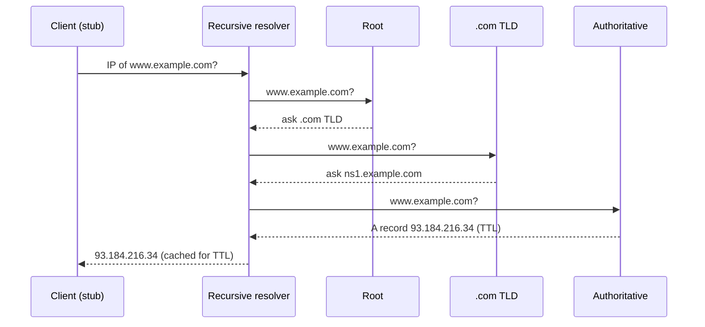
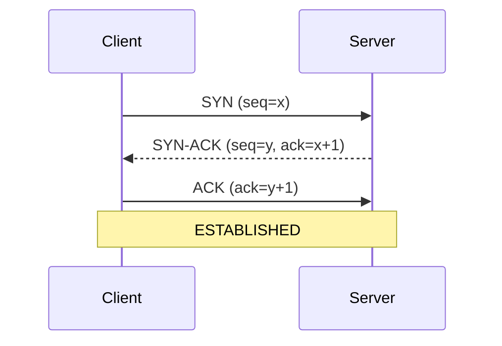

# 1.1 Networking & Request Lifecycle — Day 1: IP, DNS, TCP vs UDP

## One-page summary
- IP address finds the machine. Port finds the program. Connection = (protocol, src IP, src port, dst IP, dst port).
- DNS turns a domain into an IP. Hierarchy: root → TLD → authoritative. A recursive resolver does the walking and caches by TTL.
- TCP = reliable, ordered, connection-based (3-way handshake, ACKs, retransmit, flow + congestion control). UDP = fast, no guarantees.
- New TCP connection costs 1 RTT and starts slow, so reuse connections (keep-alive, pooling).
- Flow control protects the receiver. Congestion control protects the network.

---

## Layers
| Layer | Example | Job |
|---|---|---|
| Application | HTTP, DNS | What the data means |
| Transport | TCP, UDP | Process to process (ports) |
| Network | IP | Host to host routing |
| Link | Ethernet, Wi-Fi | Hop to hop |

IP is best-effort and unreliable. TCP adds reliability on top.

## Ports
HTTP 80 · HTTPS 443 · DNS 53 · SSH 22 · Postgres 5432 · MySQL 3306 · Redis 6379 · MongoDB 27017

---

## DNS

**Purpose:** domain name → IP (plus other records).

### Hierarchy
`www.example.com.` reads right to left: root (.) → TLD (.com) → authoritative (example.com) → host (www)

- **Root:** knows only who runs each TLD. 13 logical addresses, hundreds of physical servers (anycast).
- **TLD:** knows the authoritative servers for each domain.
- **Authoritative:** holds the real records (Route 53, Cloudflare).
- **Recursive resolver:** ISP, 8.8.8.8, 1.1.1.1. Does the work, caches results.
- **Stub resolver:** the OS/browser client that asks the recursive resolver.

### Resolution (cold cache)

Before this: browser cache → OS cache → /etc/hosts.

- **Recursive query:** client → resolver, "get me the final answer."
- **Iterative query:** resolver → root/TLD/auth, follows referrals itself.

### Record types
| Type | Meaning |
|---|---|
| A / AAAA | name → IPv4 / IPv6 |
| CNAME | alias → another name (not allowed at zone apex with other records) |
| NS | authoritative nameservers |
| MX | mail servers |
| TXT | free text (SPF, verification) |
| SOA | zone metadata |
| PTR | reverse lookup (IP → name) |

### TTL and caching
- Cached at browser, OS, resolver, sometimes app (JVM caches by default, Node doesn't).
- Low TTL: fast changes, more lookups. High TTL: fewer lookups, slow propagation.
- Before a migration, lower TTL at least one old-TTL period earlier.
- Negative caching: NXDOMAIN is cached too.

### Transport
UDP/53 normally. TCP/53 for large responses, zone transfers, DNSSEC. DoH/DoT encrypt DNS.

### System design relevance
- **Round robin:** multiple A records, crude load balancing.
- **GeoDNS / latency routing:** different IP per region.
- **Anycast:** same IP announced from many places, BGP routes to nearest. CDNs, root servers.
- **Failover:** health checks + low TTL. Only as fast as TTL; some clients ignore it.
- **Weakness:** clients cache, one resolver fronts many users, so it's a poor precise load balancer.

---

## TCP vs UDP
| | TCP | UDP |
|---|---|---|
| Connection | Yes | No |
| Reliable | Yes (ACK + retransmit) | No |
| Ordered | Yes | No |
| Flow/congestion control | Yes | No |
| Header | 20B+ | 8B |
| Unit | Byte stream | Datagram |
| Use | HTTP, DBs, SSH, email | DNS, voice/video, gaming, QUIC |

**UDP wins when:** latency matters more than completeness (late video packet is useless), the app does its own reliability (QUIC), or tiny one-shot request/response (DNS).

### 3-way handshake

- Syncs initial sequence numbers, confirms both directions work. Cost: 1 RTT.
- Why 3, not 2: server needs proof the client got its SYN-ACK; also blocks stale/duplicate SYNs.
- **SYN flood:** attacker never sends final ACK, fills half-open queue. Defense: SYN cookies, rate limiting.

### Teardown
FIN → ACK → FIN → ACK. Side that closes first enters **TIME_WAIT** (~60s). Many short connections can exhaust ports. Fix: reuse/pool connections.

### How TCP is reliable
- **Sequence numbers + ACKs:** detect loss, restore order.
- **Retransmission:** on timeout or 3 duplicate ACKs (fast retransmit).
- **Flow control:** receiver advertises window size. Protects the **receiver**.
- **Congestion control:** slow start → congestion avoidance → fast recovery (Reno, CUBIC, BBR). Protects the **network**.
- New connections start slow (initial cwnd ~10 segments), so reuse matters.
- **Nagle / TCP_NODELAY:** Nagle batches small writes; latency-sensitive apps disable it.

### Head-of-line blocking
TCP delivers in order, so one lost packet stalls everything behind it. Motivates QUIC/HTTP3 (Day 2).

---

## Common traps
- "DNS is just a lookup" → say hierarchical, cached, TTL-driven, anycast.
- "TCP is reliable" without saying how (seq, ACK, retransmit, windows).
- Mixing flow control (receiver) with congestion control (network).
- Forgetting DNS falls back to TCP.

## Self-test
1. Why does DNS use UDP, and when does it switch to TCP?
2. Recursive vs iterative query?
3. Authoritative TTL is 24h and you change the IP now. What happens?
4. Why 3-way handshake, not 2-way?
5. What is TIME_WAIT and what problem can it cause?
6. Flow control vs congestion control?
7. When pick UDP over TCP? Two examples.
8. What is anycast and who uses it?
9. Cost of a new TCP connection, and how to avoid paying it repeatedly?

## Things I got wrong
- (fill in after your recall drill)