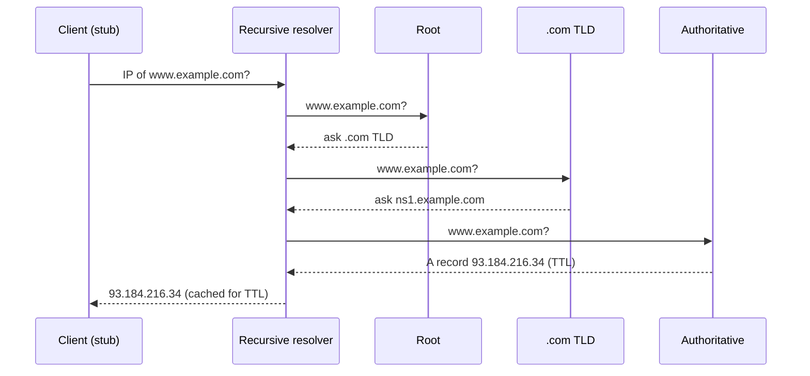
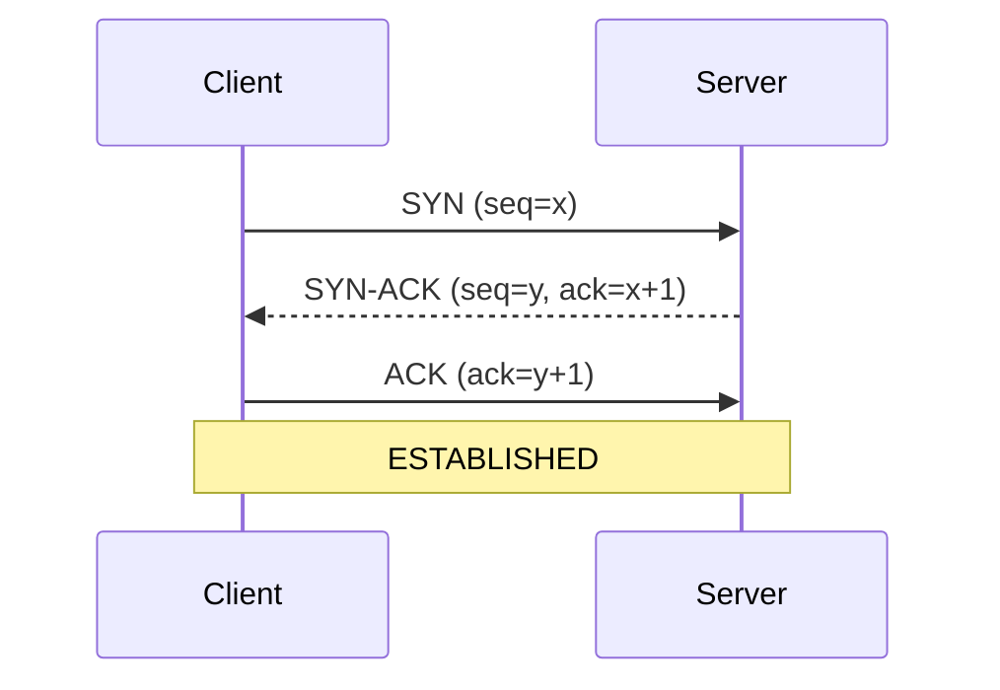
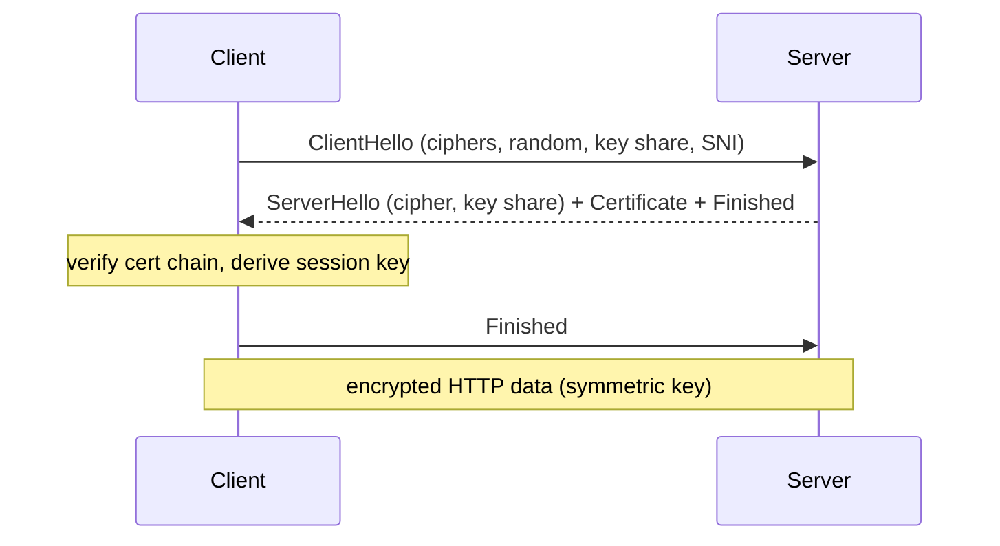

# 1.1 Networking & Request Lifecycle — Day 1: IP, DNS, TCP vs UDP

## One-page summary
- IP address finds the machine. Port finds the program. Connection = (protocol, src IP, src port, dst IP, dst port).
- DNS turns a domain into an IP. Hierarchy: root → TLD → authoritative. A recursive resolver does the walking and caches by TTL.
- TCP = reliable, ordered, connection-based (3-way handshake, ACKs, retransmit, flow + congestion control). UDP = fast, no guarantees.
- New TCP connection costs 1 RTT and starts slow, so reuse connections (keep-alive, pooling).
- Flow control protects the receiver. Congestion control protects the network.

---

## Layers
| Layer | Example | Job |
|---|---|---|
| Application | HTTP, DNS | What the data means |
| Transport | TCP, UDP | Process to process (ports) |
| Network | IP | Host to host routing |
| Link | Ethernet, Wi-Fi | Hop to hop |

IP is best-effort and unreliable. TCP adds reliability on top.

## Ports
HTTP 80 · HTTPS 443 · DNS 53 · SSH 22 · Postgres 5432 · MySQL 3306 · Redis 6379 · MongoDB 27017

---

## DNS

**Purpose:** domain name → IP (plus other records).

### Hierarchy
`www.example.com.` reads right to left: root (.) → TLD (.com) → authoritative (example.com) → host (www)

- **Root:** knows only who runs each TLD. 13 logical addresses, hundreds of physical servers (anycast).
- **TLD:** knows the authoritative servers for each domain.
- **Authoritative:** holds the real records (Route 53, Cloudflare).
- **Recursive resolver:** ISP, 8.8.8.8, 1.1.1.1. Does the work, caches results.
- **Stub resolver:** the OS/browser client that asks the recursive resolver.

### Resolution (cold cache)

Before this: browser cache → OS cache → /etc/hosts.

- **Recursive query:** client → resolver, "get me the final answer."
- **Iterative query:** resolver → root/TLD/auth, follows referrals itself.

### Record types
| Type | Meaning |
|---|---|
| A / AAAA | name → IPv4 / IPv6 |
| CNAME | alias → another name (not allowed at zone apex with other records) |
| NS | authoritative nameservers |
| MX | mail servers |
| TXT | free text (SPF, verification) |
| SOA | zone metadata |
| PTR | reverse lookup (IP → name) |

### TTL and caching
- Cached at browser, OS, resolver, sometimes app (JVM caches by default, Node doesn't).
- Low TTL: fast changes, more lookups. High TTL: fewer lookups, slow propagation.
- Before a migration, lower TTL at least one old-TTL period earlier.
- Negative caching: NXDOMAIN is cached too.

### Transport
UDP/53 normally. TCP/53 for large responses, zone transfers, DNSSEC. DoH/DoT encrypt DNS.

### System design relevance
- **Round robin:** multiple A records, crude load balancing.
- **GeoDNS / latency routing:** different IP per region.
- **Anycast:** same IP announced from many places, BGP routes to nearest. CDNs, root servers.
- **Failover:** health checks + low TTL. Only as fast as TTL; some clients ignore it.
- **Weakness:** clients cache, one resolver fronts many users, so it's a poor precise load balancer.

---

## TCP vs UDP
| | TCP | UDP |
|---|---|---|
| Connection | Yes | No |
| Reliable | Yes (ACK + retransmit) | No |
| Ordered | Yes | No |
| Flow/congestion control | Yes | No |
| Header | 20B+ | 8B |
| Unit | Byte stream | Datagram |
| Use | HTTP, DBs, SSH, email | DNS, voice/video, gaming, QUIC |

**UDP wins when:** latency matters more than completeness (late video packet is useless), the app does its own reliability (QUIC), or tiny one-shot request/response (DNS).

### 3-way handshake

- Syncs initial sequence numbers, confirms both directions work. Cost: 1 RTT.
- Why 3, not 2: server needs proof the client got its SYN-ACK; also blocks stale/duplicate SYNs.
- **SYN flood:** attacker never sends final ACK, fills half-open queue. Defense: SYN cookies, rate limiting.

### Teardown
FIN → ACK → FIN → ACK. Side that closes first enters **TIME_WAIT** (~60s). Many short connections can exhaust ports. Fix: reuse/pool connections.

### How TCP is reliable
- **Sequence numbers + ACKs:** detect loss, restore order.
- **Retransmission:** on timeout or 3 duplicate ACKs (fast retransmit).
- **Flow control:** receiver advertises window size. Protects the **receiver**.
- **Congestion control:** slow start → congestion avoidance → fast recovery (Reno, CUBIC, BBR). Protects the **network**.
- New connections start slow (initial cwnd ~10 segments), so reuse matters.
- **Nagle / TCP_NODELAY:** Nagle batches small writes; latency-sensitive apps disable it.

### Head-of-line blocking
TCP delivers in order, so one lost packet stalls everything behind it. Motivates QUIC/HTTP3 (Day 2).

---

## Common traps
- "DNS is just a lookup" → say hierarchical, cached, TTL-driven, anycast.
- "TCP is reliable" without saying how (seq, ACK, retransmit, windows).
- Mixing flow control (receiver) with congestion control (network).
- Forgetting DNS falls back to TCP.

## Self-test
1. Why does DNS use UDP, and when does it switch to TCP?
2. Recursive vs iterative query?
3. Authoritative TTL is 24h and you change the IP now. What happens?
4. Why 3-way handshake, not 2-way?
5. What is TIME_WAIT and what problem can it cause?
6. Flow control vs congestion control?
7. When pick UDP over TCP? Two examples.
8. What is anycast and who uses it?
9. Cost of a new TCP connection, and how to avoid paying it repeatedly?

## Things I got wrong
- (fill in after your recall drill)


---

# Day 2: HTTP and HTTPS/TLS

## One-page summary
- HTTP = stateless request/response over TCP. Client always starts.
- Idempotent methods (GET, PUT, DELETE) are safe to retry. POST is not (use idempotency keys).
- 401 = not authenticated, 403 = not allowed, 502 = bad upstream reply, 504 = upstream timeout.
- 1.1: keep-alive. 2: multiplexing, still TCP HOL blocking. 3: QUIC over UDP, independent streams.
- HTTPS = HTTP + TLS: confidentiality, integrity, authentication.
- TLS: asymmetric/ECDHE to agree on a key, symmetric (AES-GCM) to encrypt data.
- Certificate signed by a trusted CA proves server identity.
- Cold HTTPS request is about 4 RTTs before first byte (DNS + TCP + TLS 1.3 + HTTP).

---

## HTTP

### Request
```
GET /api/users?id=5 HTTP/1.1      <- method, path+query, version
Host: example.com                 <- headers
Authorization: Bearer <token>
Cookie: sid=abc

<optional body>
```

### Response
```
HTTP/1.1 200 OK                   <- status line
Content-Type: application/json
Cache-Control: max-age=60
Set-Cookie: sid=abc; HttpOnly

{...}
```

### Methods
| Method | Safe | Idempotent | Notes |
|---|---|---|---|
| GET | yes | yes | read |
| HEAD | yes | yes | headers only |
| POST | no | no | create / action |
| PUT | no | yes | full replace |
| PATCH | no | usually no | partial update |
| DELETE | no | yes | |
| OPTIONS | yes | yes | CORS preflight |

Idempotent = repeating gives same result as doing it once. Matters for retries. PUT `/users/5` ten times = same state. POST `/orders` ten times = ten orders.

### Status codes
| Range | Meaning | Remember |
|---|---|---|
| 1xx | info | 101 Switching Protocols (WebSocket) |
| 2xx | success | 200, 201 Created, 204 No Content |
| 3xx | redirect | 301 permanent, 302/307 temporary, 304 Not Modified |
| 4xx | client error | 400, 401, 403, 404, 409 conflict, 429 rate limited |
| 5xx | server error | 500, 502, 503, 504 |

- 401 = "who are you?", 403 = "I know you, no."
- 502 = proxy got bad/refused reply from upstream. 504 = upstream timed out.

### Headers
- **Caching:** `Cache-Control` (max-age, no-store, no-cache, public/private), `ETag` + `If-None-Match`, `Last-Modified` + `If-Modified-Since`. Unchanged -> 304, no body.
- **Content:** `Content-Type`, `Content-Length`, `Content-Encoding` (gzip, br), `Accept`.
- **Connection:** `Host` (required in 1.1, enables virtual hosting), `Connection: keep-alive`.
- **Auth/state:** `Authorization`, `Cookie`, `Set-Cookie` flags: HttpOnly (blocks JS read, stops XSS theft), Secure (HTTPS only), SameSite (limits CSRF).
- **Proxy:** `X-Forwarded-For` (real client IP), `X-Forwarded-Proto`.
- **CORS:** `Origin`, `Access-Control-Allow-*`. Browser blocks cross-origin reads unless the server allows.
- **Security:** `Strict-Transport-Security` (HSTS), `Content-Security-Policy`.

### Stateless
Server remembers nothing between requests. State travels in cookies/tokens or lives in a shared store (Redis). Any server can handle any request, so horizontal scaling works.

### Versions
| Version | Transport | Key points |
|---|---|---|
| 1.0 | TCP | new connection per request |
| 1.1 | TCP | keep-alive, Host header. One request at a time per connection (HTTP-level HOL blocking). Browsers open ~6 parallel connections per host |
| 2 | TCP | multiplexing many streams on one connection, binary framing, HPACK header compression. Still TCP-level HOL blocking |
| 3 | QUIC (UDP) | independent streams, built-in TLS 1.3, faster setup, connection migration (Wi-Fi to cellular) |

---

## HTTPS / TLS

### Why
Plain HTTP can be read, modified, or impersonated by anyone on the path.

| Goal | How |
|---|---|
| Confidentiality | encryption |
| Integrity | tamper detection (MAC/AEAD) |
| Authentication | certificates |

TLS sits between TCP and HTTP. Port 443.

### Symmetric vs asymmetric
- **Symmetric:** same key locks/unlocks. Fast. Used for data (AES-GCM, ChaCha20). Problem: how to share the key.
- **Asymmetric:** public/private key pair. Slow. Used to authenticate and agree on a key (ECDHE, RSA signatures).
- **TLS uses both:** asymmetric briefly to agree on a secret, symmetric for all data.
- ECDHE: both sides build the same secret over a public channel without sending it.

### Certificates
Certificate = "this public key belongs to example.com", signed by a CA.

Chain: leaf (server) -> intermediate CA -> root CA (pre-installed in browser/OS trust store).

Client checks:
1. Chains to a trusted root
2. Domain matches (CN/SAN)
3. Not expired or revoked (CRL/OCSP)
4. Signature valid

Any failure -> "connection not private" warning.

### TLS 1.3 handshake


- TLS 1.2: 2 RTT. TLS 1.3: 1 RTT, weak ciphers removed, forward secrecy mandatory.
- **0-RTT resumption:** replay risk, use only for idempotent requests.
- **Session resumption (tickets):** skip full handshake on reconnect.

### Terms
- **SNI:** client sends domain in ClientHello so one IP can host many HTTPS sites and server picks the right cert.
- **Forward secrecy:** ephemeral keys, so a leaked server key can't decrypt past traffic.
- **HSTS:** browser always uses HTTPS for that domain (prevents downgrade).
- **TLS termination:** LB/reverse proxy decrypts, forwards plain or re-encrypted traffic to backends.
- **mTLS:** client also presents a certificate. Common between microservices.

### What HTTPS does not hide
- Destination IP, and domain (via SNI and DNS, unless ECH/DoH).
- Does not protect against malicious servers, SQL injection, XSS.

---

## Cold HTTPS request cost
| Step | RTT |
|---|---|
| DNS | 1+ |
| TCP handshake | 1 |
| TLS 1.3 | 1 |
| HTTP request/response | 1 |
| **Total** | **~4** (5 with TLS 1.2) |

Why these exist: keep-alive / pooling (skip TCP+TLS), CDN (shorter distance), TLS 1.3 + HTTP/3 (fewer RTTs), DNS caching/prefetch.

---

## Common traps
- Claiming HTTP/2 fully fixes HOL blocking (only HTTP-level; TCP-level remains, HTTP/3 fixes it).
- Saying HTTPS "encrypts data with the public key" (asymmetric is only for key agreement).
- Mixing 401/403 or 502/504.
- Not knowing why POST isn't safe to retry.
- Forgetting the domain still leaks via SNI/DNS.

## Self-test
1. Four parts of an HTTP request?
2. Why is PUT idempotent and POST not? Why does it matter?
3. 401 vs 403? 502 vs 504?
4. What does 304 mean, and which headers enable it?
5. What does HttpOnly do?
6. What does HTTP/2 solve over 1.1? What remains? How does HTTP/3 fix it?
7. Why does TLS use both asymmetric and symmetric?
8. What does a certificate prove, and who vouches for it?
9. What does SNI solve?
10. What is forward secrecy?
11. RTTs for a cold HTTPS request?
12. What is TLS termination?

## Things I got wrong
- (fill in after your recall drill)